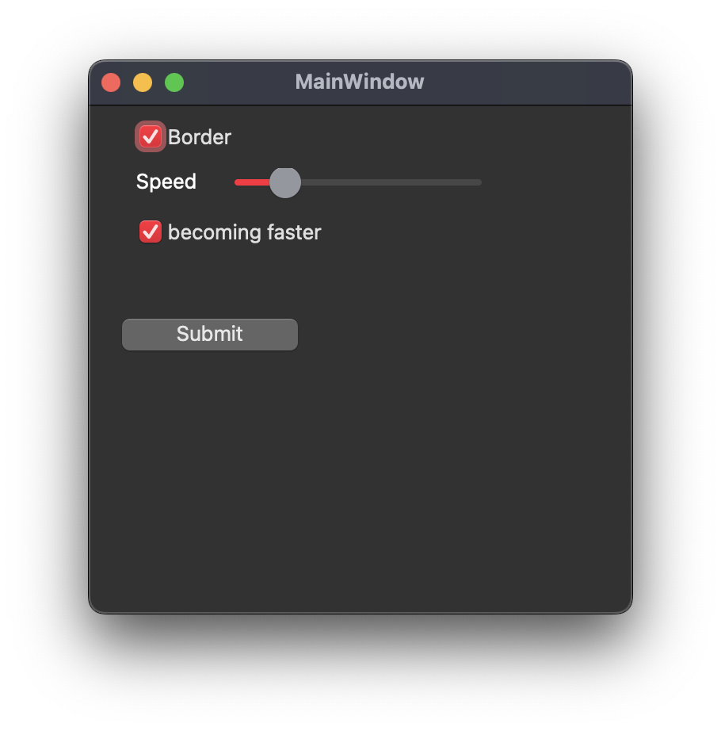
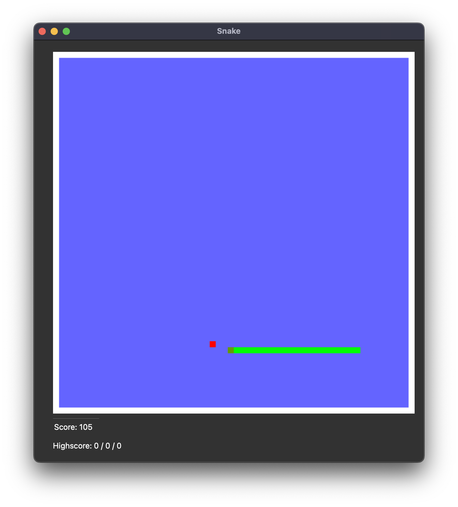

# 🐍 Classic Snake Game

Welcome to the classic Snake game! This is a simple, yet addictive version of the nostalgic Snake game, designed to be easy to play but challenging to master. Enjoy the retro charm and bring back memories with this timeless arcade game.

## 🎮 About the Game

The Classic Snake Game is a minimalist version of the iconic arcade game that was first popularized on early mobile phones. In this game, you control a snake that grows longer as it consumes food. The goal is simple: eat as much food as possible without colliding with yourself or the game boundaries.

## ✨ Features

- Classic retro-style graphics for a nostalgic feel
- Simple and intuitive controls
- Increasing difficulty as the snake grows longer
- Score tracking to challenge yourself and others
- With and without border

## 🕹️ How to Play

The objective of the game is to navigate the snake and collect food items to grow longer. Avoid running into the walls or colliding with your own tail, or the game will end!

As you eat food, your snake becomes longer, making the game progressively harder. Try to achieve the highest score possible!

## 📸 Screenshots

Menue

Game

